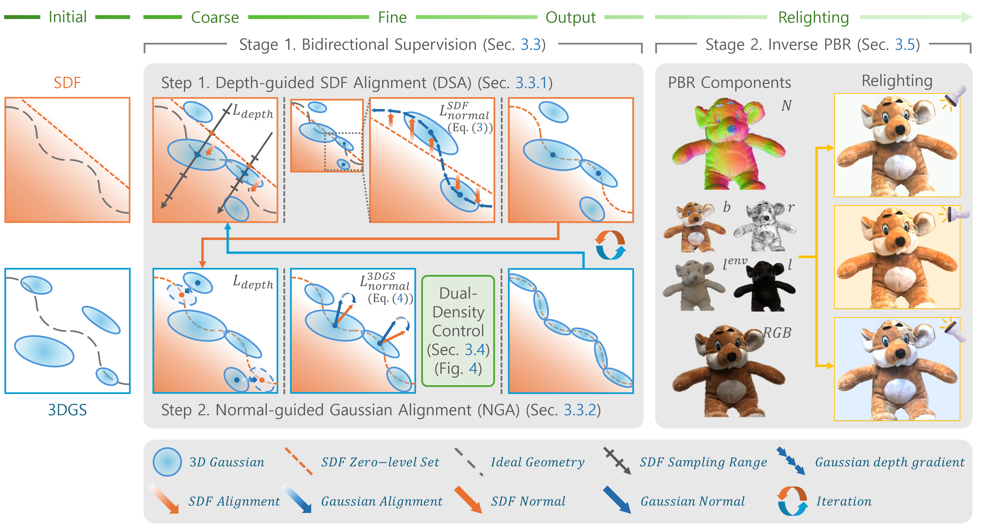

<h2>COREA</h2>

&nbsp;&nbsp;
    Jaeyoon Lee*&nbsp;
    Hojoon Jung*&nbsp;
    Sungtae Hwang&nbsp;
    Jihyong Oh†&nbsp;
    Jongwon Choi†

    Chung-Ang University, Seoul, Korea

    *Equal contribution, †Co-corresponding authors

 

<h4>
    
    
    
</h4>

---

    <h4>
        This repository is the official implementation of "<b>COREA</b>: Coarse-to-Fine 3D Representation Alignment Between  
    Relightable 3D Gaussians and SDF via Bidirectional 3D-to-3D Supervision."
    </h4>

    🔥 <b>Physically-based relighting</b>, 
    🎯 <b>Bidirectional 3D-to-3D geometry alignment</b>, 
    🎨 <b>High-fidelity wrinkles & shading preservation</b>

 

    

---

## 📢 News
- **Dec 2025** — arXiv submission completed (coming soon)
- **Project Page launch** — Online with all demos
- **Code release plan updated**

---

## 📖 Abstract

Accurate geometry is essential for relightable 3D Gaussian splatting.  
However, existing PBR-driven methods learn 3D properties **indirectly** from rendered 2D signals, producing imprecise normals and unstable shading.

We present **COREA**, the first **unified** framework that jointly learns relightable 3D Gaussians and a neural SDF under **coarse-to-fine bidirectional geometry supervision**:

- Gaussian depth → guides SDF rays and pixel-wise depth gradients (**DSA**)
- SDF normals → supervise Gaussian normals and drive densification (**N3A**)
- **DDC** regulates splitting to ensure memory-efficient refinement

This synergy delivers **precise geometry**, **robust BRDF-lighting decomposition**, and **state-of-the-art** performance on NVS, mesh reconstruction, and relighting tasks.

---

## 🖼️ Method Overview

    

    

---

## 🔥 Key Features

| Component | What it does |
|---|---|
| **DSA** | Aligns SDF via Gaussian depth + depth gradients |
| **N3A** | Supervises Gaussian normals directly in 3D |
| **DDC** | Regulates densification to control memory growth |
| **Differentiable PBR** | Accurate BRDF & lighting decomposition |

---

## 📬 Contact

For questions, please reach out at  
📧 **leejaeyoon@vilab.cau.ac.kr**

---

⭐ If you find this repository helpful, please consider starring it!
